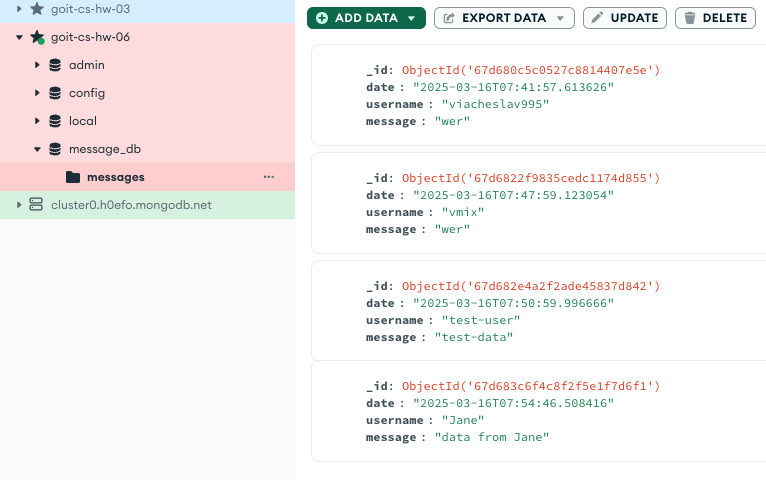

## Final task ##

**run:**

`docker compose down --volumes --remove-orphans`

`docker system prune -a`

`docker compose up --build -d`

### Procedure ###

Open the main page `localhost:3000`

Send a message as user

Check the database to see if the message has been recorded

The result is as follows:
